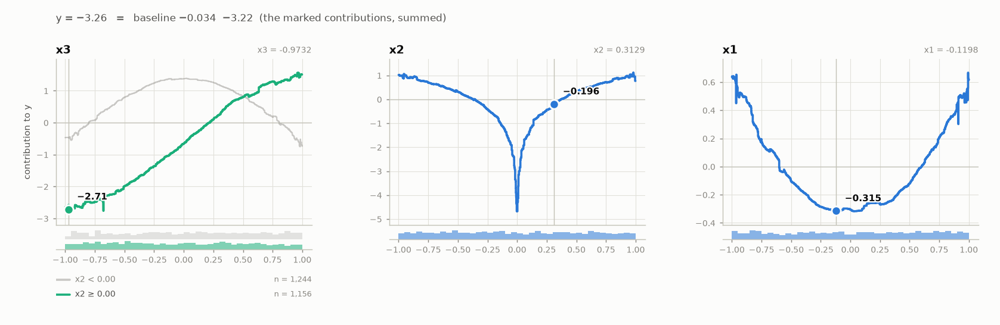

???+ success "Description"

    Fit a CALM on a synthetic problem with one known interaction, read the
    model card, see where it stands between a GAM and the black box it
    learns from, read why it split what it split, plot the fitted curves and
    take one prediction apart. The code is
    [`examples/01_quickstart.py`](./../examples.md).

???+ note "Reading time"

    Approx. 5' to read.

## A problem with one interaction

Three features, uniform in `[-1, 1]`. The effect of `x3` depends on the sign
of `x2`: a sine when `x2 >= 0`, a cosine when `x2 < 0`.

```python
import numpy as np
import pandas as pd
from sklearn.model_selection import train_test_split

rng = np.random.default_rng(0)
X = pd.DataFrame(rng.uniform(-1, 1, (3000, 3)), columns=["x1", "x2", "x3"])
y = (
    X["x1"] ** 2
    + np.log(np.abs(X["x2"]))
    + 2 * np.where(X["x2"] >= 0, np.sin(np.pi / 2 * X["x3"]), np.cos(np.pi / 2 * X["x3"]))
    + rng.normal(0, 0.3, len(X))
)
X_train, X_test, y_train, y_test = train_test_split(X, y, test_size=0.2, random_state=0)
```

A GAM gives `x3` one curve, so it has to average the sine and the cosine.

## One call fits everything

```python
from calm_additive import CALMRegressor

calm = CALMRegressor(max_partition_depth=1)
calm.fit(X_train, y_train)
```

`fit` trains a black box (XGBoost by default), looks for regions where a
feature's effect differs, keeps the regions that matter, and fits one curve
per (feature, region). `max_partition_depth=1` allows each feature at most two curves.

👉 A DataFrame brings its column names along; a numpy array works too, with
features named `x_0, x_1, ...`.

## The model on one screen

```python
calm.print_summary(X_test, y_test)
```

```text
  ════════════════════════════════════════════════════════════════════════
  CALM regressor  ·  target: y
  ════════════════════════════════════════════════════════════════════════

  MODEL
  ────────────────────────────────────────────────────────────────────────
    trained on    2,400 rows · 3 features
    structure     4 curves · 1 partition · 1 conditional interaction
    baseline      −0.034  (the average prediction)

  WHERE IT STANDS                            on the data passed · 600 rows
  ────────────────────────────────────────────────────────────────────────
                                                          RMSE          R²
    GAM         ebm curves, no partitions                0.885       0.717
    CALM                                                 0.372       0.950
    black box   the teacher (xgb)                        0.411       0.939

    CALM is above the black box in R²

  FEATURES                          importance = mean |contribution|, in y
  ────────────────────────────────────────────────────────────────────────
    feature       importance                curves  depends on
    ──────────────────────────────────────────────────────────────────────
    x3                  1.07  ████████████       2  x2
    x2                  0.73  ████████           1  —
    x1                  0.25  ███                1  —

  PARTITIONS                                            one curve per leaf
  ────────────────────────────────────────────────────────────────────────
    x3
    ├─ x2 < 0.00   n = 1,244
    └─ x2 ≥ 0.00   n = 1,156
```

`print_summary()` prints the model card: how large the model is, each feature's
importance and what its curves depend on, and every partition as a tree.
`x3` has two curves, one per side of `x2 = 0`: the interaction that was put
in the data.

## CALM closes the gap to the black box

Because held-out data was passed, the card also says *where it stands*. The
GAM is the same curve fitter with no partitions, so the only difference
between the first two rows is the two curves of `x3`. Here CALM even ends
above its teacher.

## The ledger says why

```python
calm.chain_.show()
```

```text
  EXPLAINED VARIANCE
  ────────────────────────────────────────────────────────────────────────
    step         split on                 solo     ΔR²      R²       heter
    ──────────────────────────────────────────────────────────────────────
    GAM          (all features global)       —       —   75.2%           —
  + x3           x2                     +20.6%  +20.6%   95.8% 0.76 → 0.15
    ──────────────────────────────────────────────────────────────────────
    FINAL                                                95.8%

  REJECTED SPLITS                                            min gain 1.0%
  ────────────────────────────────────────────────────────────────────────
    feature      split on                 solo     ΔR²    reason
    ──────────────────────────────────────────────────────────────────────
  ✗ x2           x3                     +16.0%  -15.3%    redundant

    ✗ redundant: it would explain variance on its own (see solo),
      but the accepted splits already account for it.
```

One split was kept: `x3`, conditioned on `x2`. It lifts the additive
surrogate from 75.2% to 95.8%. The mirror split, `x2` conditioned on `x3`,
describes the same interaction a second time, so it was rejected as
**redundant**.

!!! warning "The R² in the ledger is not test accuracy"

    It measures how much of the **black box** an additive model explains, on
    the training data. Test accuracy is the *where it stands* block above.

## The model is its plots

```python
calm.plot_curves()
```


`x3` has two curves: the cosine when `x2 < 0`, the sine when `x2 >= 0`. The
strip under each panel shows where the training rows are, one row of bars
per region. A prediction is the baseline plus one value read off each panel;
for `x3`, off the curve whose condition the row satisfies.

👉 `calm.plot_curves("x3")` draws one feature large, `calm.plot_importance()` the
features by importance.

## One prediction, taken apart

```python
row = X_test.iloc[0]
calm.print_prediction(row)
```

```text
  PREDICTION                                                     y = −3.26
  ────────────────────────────────────────────────────────────────────────
    feature = value     because               contribution
    ──────────────────────────────────────────────────────────────────────
    x3 = -0.9732        x2 ≥ 0.00                    −2.71 ███████│
    x1 = -0.1198                                     −0.31       █│
    x2 = 0.3129                                      −0.20       █│
    ──────────────────────────────────────────────────────────────────────
    baseline (average prediction)                    −0.03
    + contributions                                  −3.22
    = y                                              −3.26
```

The lines add up to the prediction exactly. `x3`'s line names the region
whose curve was read. The same row on the curves:

```python
calm.plot_curves(at=row)
```



👉 `calm.plot_prediction(row)` draws the ledger as a waterfall;
`calm.contributions(X)` returns the numbers for many rows at once.

---

## Where to next

- [A real dataset](./real_data.md): the same steps on Bike Sharing
- [How it works](./how_it_works.md): what `fit` does, step by step
- [Choosing the knobs](./choosing_the_knobs.md): `max_partition_depth`, `min_r2_gain` and the rest
