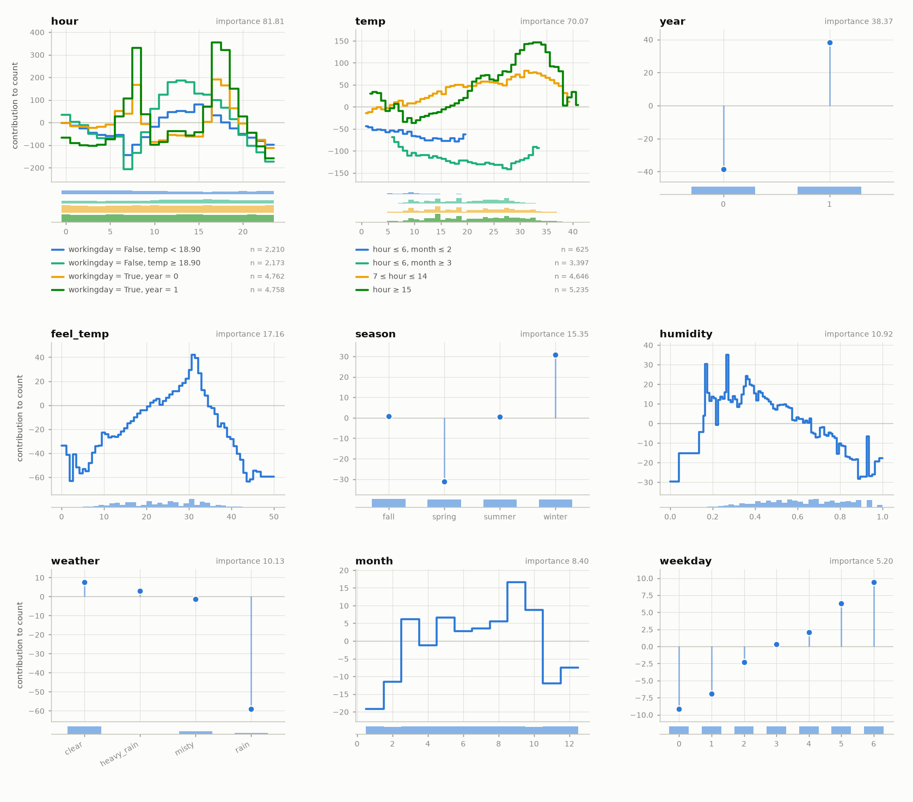
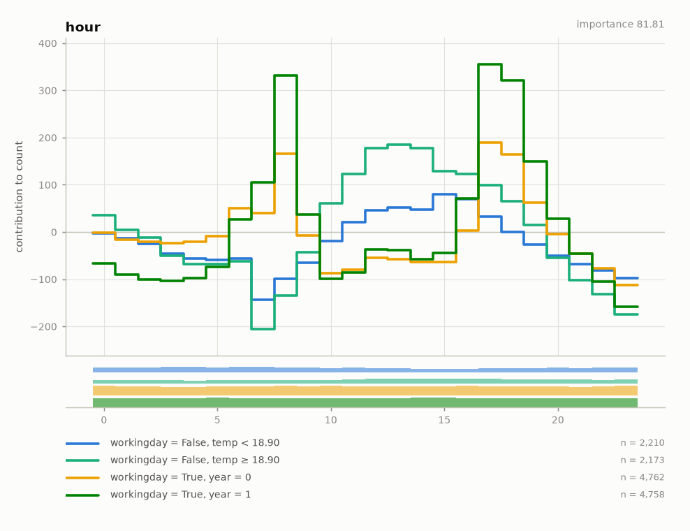
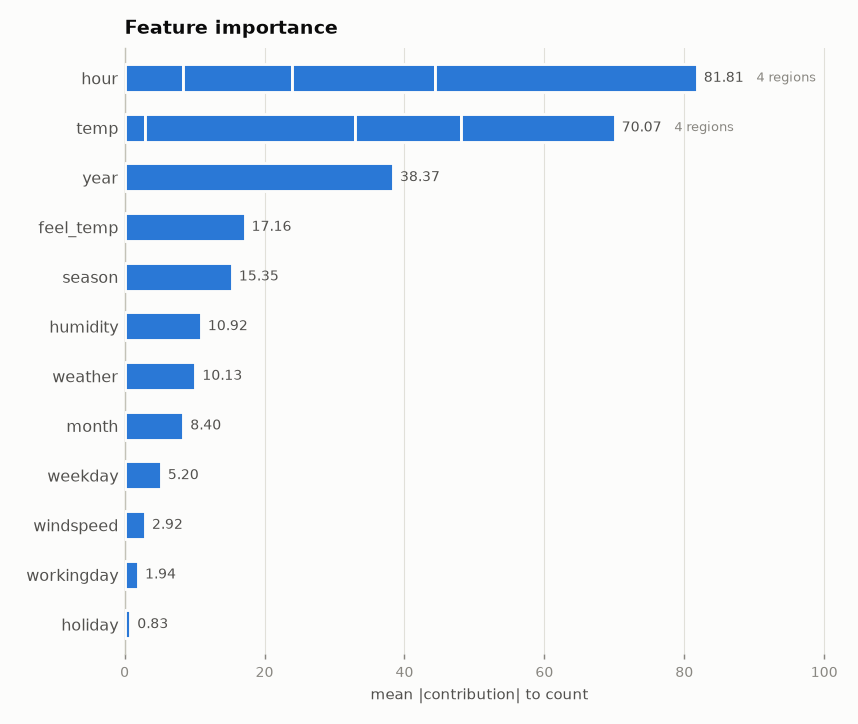
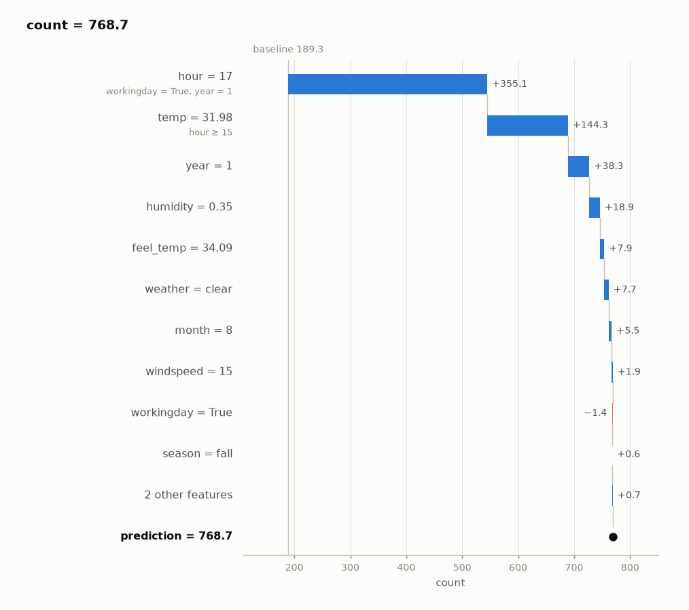
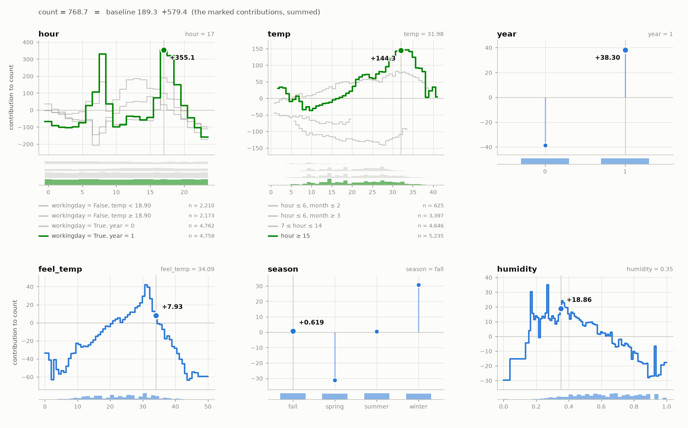

???+ success "Description"

    CALM on Bike Sharing: hourly bike rentals, 17,379 rows, 12 features, some
    of them categorical. The code is
    [`examples/02_real_data.py`](./../examples.md), which also runs on
    California Housing, Phoneme, or your own CSV.

???+ note "Reading time"

    Approx. 5' to read.

## A DataFrame goes straight in

```python
from sklearn.datasets import fetch_openml
from sklearn.model_selection import train_test_split

df = fetch_openml("Bike_Sharing_Demand", version=2, as_frame=True).frame
X, y = df.drop(columns="count"), df["count"].astype(float)
X_train, X_test, y_train, y_test = train_test_split(X, y, test_size=0.2, random_state=0)
```

`season`, `holiday`, `workingday` and `weather` are pandas categoricals.
CALM encodes them itself and keeps their level names for the rules and the
plots. `y` is a pandas Series, so its name, `count`, becomes the target's
name in everything CALM prints and draws.

```python
from calm_additive import CALMRegressor

calm = CALMRegressor(max_partition_depth=2)
calm.fit(X_train, y_train)
```

## The model card

```python
calm.print_summary(X_test, y_test)
```

```text
  ════════════════════════════════════════════════════════════════════════
  CALM regressor  ·  target: count
  ════════════════════════════════════════════════════════════════════════

  MODEL
  ────────────────────────────────────────────────────────────────────────
    trained on    13,903 rows · 12 features
    structure     18 curves · 2 partitions · 5 conditional interactions
    baseline      189.3  (the average prediction)

  WHERE IT STANDS                          on the data passed · 3,476 rows
  ────────────────────────────────────────────────────────────────────────
                                                          RMSE          R²
    GAM         ebm curves, no partitions                100.6       0.697
    CALM                                                  60.6       0.890
    black box   the teacher (xgb)                         41.0       0.950

    GAM ●━━━━━━━━━━━━━━━━━━━━━━━━━━━━━━━━●─────────○ black box
                                       CALM
    CALM covers 76% of the distance from the GAM to the black box, in R²

  FEATURES                      importance = mean |contribution|, in count
  ────────────────────────────────────────────────────────────────────────
    feature       importance                curves  depends on
    ──────────────────────────────────────────────────────────────────────
    hour               81.81  ████████████       4  workingday, temp, year
    temp               70.07  ██████████         4  hour, month
    year               38.37  ██████             1  —
    feel_temp          17.16  ███                1  —
    season             15.35  ██                 1  —
    humidity           10.92  ██                 1  —
    weather            10.13  █                  1  —
    month               8.40  █                  1  —
    weekday             5.20  █                  1  —
    windspeed           2.92                     1  —
    workingday          1.94                     1  —
    holiday             0.83                     1  —

  PARTITIONS                                            one curve per leaf
  ────────────────────────────────────────────────────────────────────────
    hour
    ├─ workingday = False
    │  ├─ temp < 18.90      n = 2,210
    │  └─ temp ≥ 18.90      n = 2,173
    └─ workingday = True
       ├─ year = 0          n = 4,762
       └─ year = 1          n = 4,758

    temp
    ├─ hour ≤ 6
    │  ├─ month ≤ 2       n = 625
    │  └─ month ≥ 3       n = 3,397
    └─ hour ≥ 7
       ├─ 7 ≤ hour ≤ 14   n = 4,646
       └─ hour ≥ 15       n = 5,235
```

## Between the GAM and the black box

On the held-out fifth, CALM removes most of the GAM's error and stays below
the black box. That is the expected place for it: every curve is still
one-dimensional. The GAM here is the same EBM with no partitions, fitted on
the same training data.

## Two features carry the interactions

`hour` and `temp` have four curves each and the highest importance; the
trees at the bottom of the card are their regions. Why these two, and not
`workingday` or `year`, is the selection ledger:

```python
calm.chain_.show()
```

```text
  EXPLAINED VARIANCE
  ────────────────────────────────────────────────────────────────────────
    step         split on                 solo     ΔR²      R²       heter
    ──────────────────────────────────────────────────────────────────────
    GAM          (all features global)       —       —   65.8%           —
  + hour         temp, workingday, y…   +15.2%  +15.2%   81.1%     85 → 46
  + temp         hour, month             +2.8%   +1.6%   82.7%     33 → 23
    ──────────────────────────────────────────────────────────────────────
    FINAL                                                82.7%

  REJECTED SPLITS                                            min gain 1.0%
  ────────────────────────────────────────────────────────────────────────
    feature      split on                 solo     ΔR²    reason
    ──────────────────────────────────────────────────────────────────────
  ✗ year         hour                    +2.7%   -0.5%    redundant
  ✗ month        feel_temp, hour, hu…    +1.7%   +0.1%    below threshold
  ✗ workingday   hour                    +6.3%   -0.4%    redundant
  ✗ humidity     hour, season, temp      +1.9%   +0.5%    below threshold

    ✗ redundant: it would explain variance on its own (see solo),
      but the accepted splits already account for it.
```

Six features were candidates; two were split. `workingday` would explain
6.3% on its own, but `hour` is already conditioned on it, so its split is
redundant.

## The curves

```python
calm.plot_curves()
```



Panels are ordered by importance. Each curve is drawn only where its region
has data, and the strips under a panel show how the rows are spread, one row
of bars per region. Categorical features (`season`, `weather`, `year`) are
one mark per level.

```python
calm.plot_curves("hour")
```



The `hour` panel shows what the GAM cannot: on working days rentals peak at
the commute hours, on days off they rise once around midday, and the
working-day shape is larger in the second year.

```python
calm.plot_importance()
```



## Why this prediction

The held-out hour with the highest predicted count:

```python
row = X_test.iloc[int(calm.predict(X_test).argmax())]
calm.print_prediction(row)
```

```text
  PREDICTION                                                 count = 768.7
  ────────────────────────────────────────────────────────────────────────
    feature = value     because               contribution
    ──────────────────────────────────────────────────────────────────────
    hour = 17           workingday = True,          +355.1        │███████
                        year = 1
    temp = 31.98        hour ≥ 15                   +144.3        │███
    year = 1                                         +38.3        │█
    humidity = 0.35                                  +18.9        │
    feel_temp = 34.09                                 +7.9        │
    weather = clear                                   +7.7        │
    month = 8                                         +5.5        │
    windspeed = 15                                    +1.9        │
    workingday = True                                 −1.4        │
    season = fall                                     +0.6        │
    … 2 more features                                 +0.7        │
    ──────────────────────────────────────────────────────────────────────
    baseline (average prediction)                    189.3
    + contributions                                 +579.4
    = count                                          768.7
```

A working day of the second year at 5 pm, 32 °C: the commute peak of the
`workingday = True, year = 1` curve adds 355 rentals to the average hour.

```python
calm.plot_prediction(row)     # the same numbers as a waterfall
calm.plot_curves(at=row)      # the row marked on its curves
```





---

## Where to next

- [Choosing the knobs](./choosing_the_knobs.md): try `max_partition_depth=1`, or a higher `min_r2_gain`
- [How it works](./how_it_works.md): where the regions come from
- [API: estimators](./../api_docs/api_estimators.md): everything `calm` exposes after `fit`
