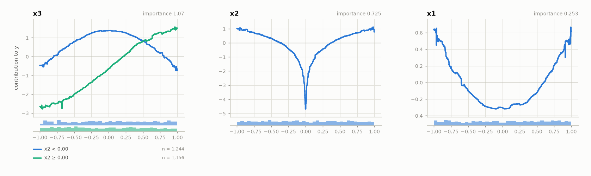

# calm-additive

**CALM: interpretable by design.** Accurate locally additive models for tabular data.

---

`calm-additive` fits **CALMs** (Conditionally Additive Local Models). It:

- gives every feature a plain 1D curve, like a GAM, so the model can be read plot by plot
- lets a feature have [several curves](./guides/how_it_works.md), each valid in a region of the other features, which is how it captures interactions a GAM misses
- [finds those regions itself](./guides/quickstart.md), from a black-box teacher, and keeps only the ones that earn their complexity
- [explains itself](./api_docs/api_views.md): a model card, the curves, and every prediction as a sum you can read line by line
- shows its reasoning: a [ledger](./guides/quickstart.md#the-ledger-says-why) of every split it kept and every split it rejected
- has a scikit-learn API: `fit`, `predict`, and [keyword arguments](./api_docs/api_config.md) for the knobs

---

📖 [Guides](./guides.md) | 🚀 [Quickstart](./guides/quickstart.md) | 🔧 [API](./api_docs.md) | 🏗 [Examples](./examples.md)

---

## Installation

`calm-additive` requires Python 3.10+.

```bash
pip install calm-additive
```

---

## Quickstart

A synthetic problem with one interaction: the effect of `x3` is a sine when
`x2 >= 0` and a cosine when `x2 < 0`.

```python
import numpy as np
import pandas as pd
from calm_additive import CALMRegressor

rng = np.random.default_rng(0)
X = pd.DataFrame(rng.uniform(-1, 1, (3000, 3)), columns=["x1", "x2", "x3"])
y = (
    X["x1"] ** 2
    + np.log(np.abs(X["x2"]))
    + 2 * np.where(X["x2"] >= 0, np.sin(np.pi / 2 * X["x3"]), np.cos(np.pi / 2 * X["x3"]))
    + rng.normal(0, 0.3, len(X))
)

calm = CALMRegressor(max_partition_depth=1).fit(X, y)
calm.print_summary()                # the model on one screen
calm.plot_curves()                  # one panel per feature, one curve per region
calm.print_prediction(X.iloc[0])    # why this prediction
calm.chain_.show()                  # why each split was kept or rejected
```

CALM finds the split and fits one curve per side:



On a held-out fifth of the data (`calm.print_summary(X_test, y_test)` prints this
comparison):

| model | test R² |
|---|---|
| GAM (EBM, no interactions) | 0.717 |
| **CALM** | **0.950** |
| black box (XGBoost, the teacher) | 0.939 |

📄 In depth: [the quickstart guide](./guides/quickstart.md) walks through every line and its output.

---

## The knobs

| knob | what it decides |
|---|---|
| `max_conditional_interactions` | the most conditional interactions the model may have |
| `max_partition_depth` | how many curves a feature may have: at most `2**max_partition_depth` |
| `min_heterogeneity_drop` | how much a split must reduce a feature's heterogeneity to be made |
| `min_r2_gain` | how much a feature's partition must explain to be kept |
| `teacher` | the black box the regions are learned from |
| `effect` | how the teacher is read: PDP, ALE, SHAP-DP or RHALE |
| `partition_features` | which features may get a partition at all |
| `curve_fitter` | what is fitted inside the regions |

📄 In depth: [choosing the knobs](./guides/choosing_the_knobs.md).

---

## Documentation map

- [Quickstart](./guides/quickstart.md): the synthetic problem, line by line
- [A real dataset](./guides/real_data.md): Bike Sharing, from a DataFrame to the curves and one prediction
- [How it works](./guides/how_it_works.md): teacher, regions, selection, refit
- [Choosing the knobs](./guides/choosing_the_knobs.md): your case, what to set
- [Examples](./examples.md): four runnable scripts
- [API Docs](./api_docs.md): the reference

---

## Citation

```bibtex
@inproceedings{gkolemis2026calm,
  title     = {Interpretability-by-Design with Accurate Locally Additive Models
               and Conditional Feature Effects},
  author    = {Gkolemis, Vasilis and Kavouras, Loukas and Kyriakopoulos, Dimitrios
               and Tsopelas, Konstantinos and Rontogiannis, Dimitrios
               and Casalicchio, Giuseppe and Dalamagas, Theodore and Diou, Christos},
  booktitle = {Advances in Neural Information Processing Systems (NeurIPS)},
  year      = {2026}
}
```

## Built on

[effector](https://github.com/givasile/effector), for reading the black box;
[InterpretML](https://interpret.ml), for the EBM fitted inside the regions;
[XGBoost](https://xgboost.readthedocs.io), for the default teacher.
